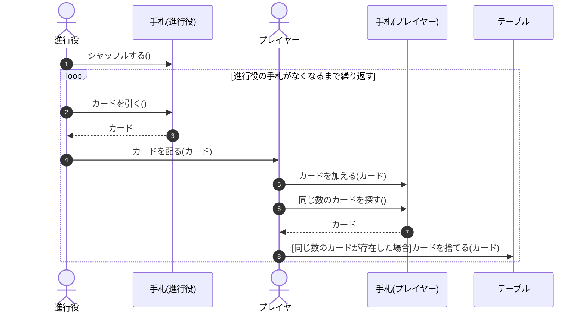

```mermaid
sequenceDiagram
    autonumber
    actor m as 進行役
    participant mh as 手札(進行役)
    actor p as プレイヤー
    participant ph as 手札(プレイヤー)
    participant t as テーブル
    m ->> mh: シャッフルする()
    loop 進行役の手札がなくなるまで繰り返す
        m ->> mh: カードを引く()
        mh -->> m: カード
        m ->> p: カードを配る(カード)
        p ->> ph: カードを加える(カード)
        p ->> ph: 同じ数のカードを探す()
        ph -->> p: カード
        p ->> t: [同じ数のカードが存在した場合]カードを捨てる(カード)
    end
```